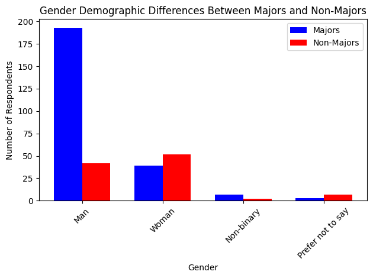
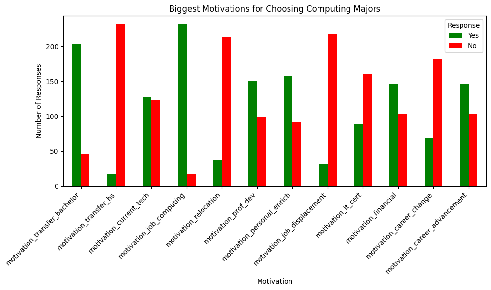
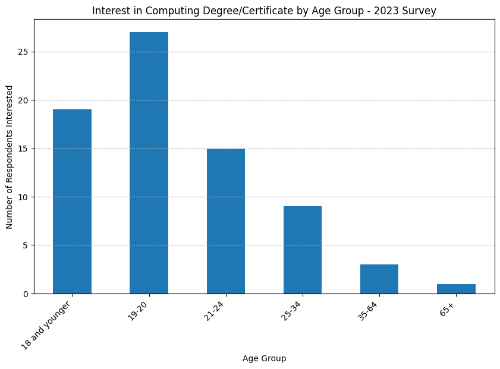

# College Recruitment Improvement Study

This project explores demographic and motivational trends in computing education at County College of Morris (CCM). Using cleaned survey data from 2021–2023, we aim to help the CCM Department of Information Technologies improve recruitment and retention strategies — especially for underrepresented groups in tech.

## Objective

The analysis answers key questions around:

- Demographics of computing majors vs. non-majors
- Motivations for enrolling in computing classes
- Changes in computing interest over time (2021–2023)
- Trends by gender, program enrollment, and year

## Methods Used

- Python (pandas, matplotlib, seaborn) for analysis and visualization
- Jupyter Notebook for data cleaning and exploration
- CSV datasets from student surveys (segmented by year, gender, and major status)

## Key Questions Answered

1. What are the gender demographic differences between Majors and Non-Majors in 2023?
2. What motivates students in Computing Majors across 2021–2023?
3. How has interest in computing changed year-to-year?
4. How do motivations vary by gender identity?

## Files

- Data Analysis and Visualization.ipynb: full notebook with analysis and plots
- Cleaned survey datasets (.csv): grouped by year, major status, and gender

## Key Insights

- Gender disparities are extremely prevelant among students with Computing Majors
- Motivations to explore computing vary widely
- Student interest in computing courses has shifted over time

## Impact

These insights will help CCM better target its recruitment strategies and improve pathways into computing education.
